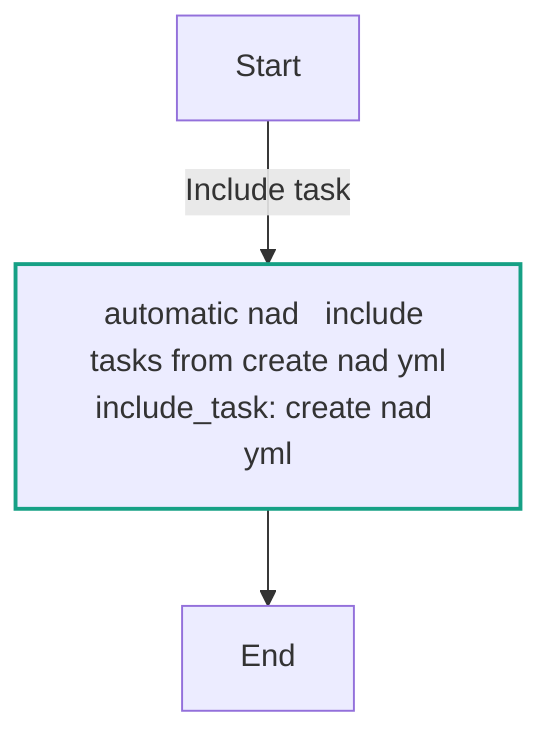
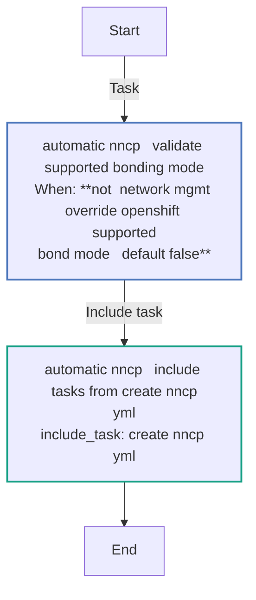
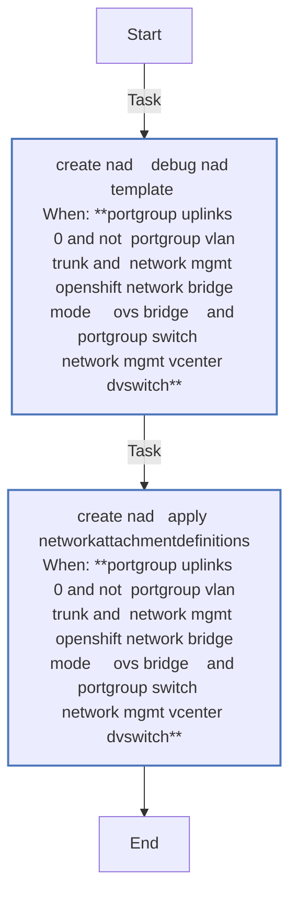
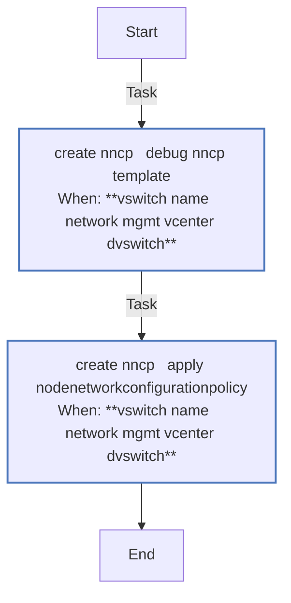
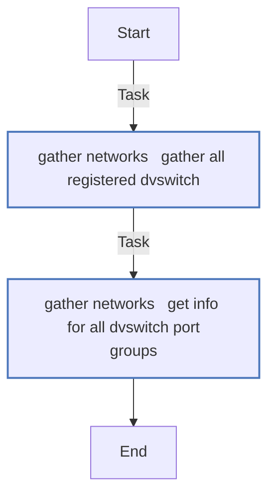
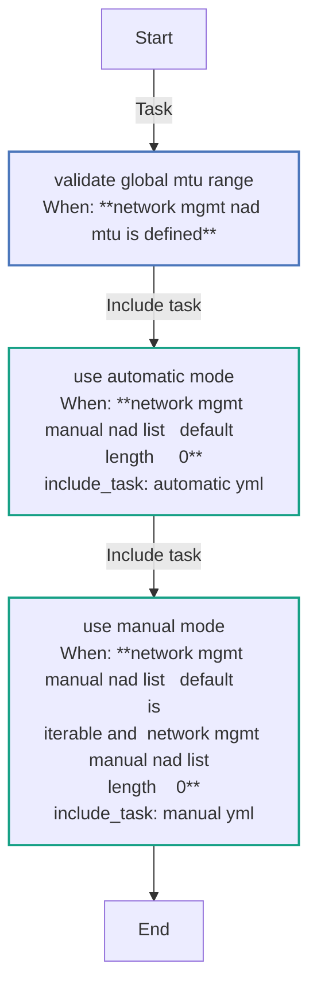
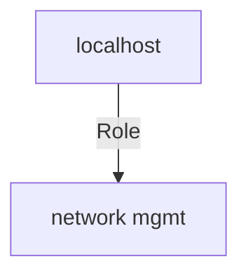

<!-- STATIC CONTENT START
Use this section for adding additional content to the README
This will not be overwritten by Docsible -->
# 📃 Role overview

This role performs network management in two modes: Manual and Automatic. It performs tasks that include gathering network information in the vCenter environment, migrate the Port Groups by creating NetworkAttachementDefinitions (NAD), and migrate distributed switches by creating NodeNetworkConfigurationPolicy (NNCP).

## Network Bridge Modes

This role supports three network bridge modes:

### 1. linux-bridge

Uses CNV bridge (cnv-bridge) for network attachment. This mode requires NNCP (NodeNetworkConfigurationPolicy) to configure the bridge on worker nodes.

### 2. ovs-bridge

Uses OVN-Kubernetes CNI overlay with `localnet` topology. This mode requires NNCP to configure the OVS bridge and localnet mapping on worker nodes.

### 3. ovn-layer2

Uses OVN-Kubernetes CNI overlay with `layer2` topology. This mode creates isolated layer2 networks without requiring NNCP or physical node network configuration.

Example NAD for ovn-layer2 mode:

```yaml
apiVersion: k8s.cni.cncf.io/v1
kind: NetworkAttachmentDefinition
metadata:
  annotations:
    infra.openshift-virtualization-migration/source-portgroup: example-portgroup-name
  name: example-network
  namespace: example-namespace
spec:
  config: |-
    {
        "cniVersion": "0.3.1",
        "name": "example-network",
        "type": "ovn-k8s-cni-overlay",
        "netAttachDefName": "example-namespace/example-network",
        "topology": "layer2"
    }
```

To use ovn-layer2 mode, set:

```yaml
network_mgmt_openshift_network_bridge_mode: ovn-layer2
network_mgmt_ovn_topology: layer2
```

#### MTU Configuration

ovn-layer2 NADs support an optional MTU setting. You can set a global MTU that applies to all ovn-layer2 NADs, and optionally override it per NAD in manual mode.

**Global MTU** (applies to all ovn-layer2 NADs unless overridden):

```yaml
network_mgmt_nad_mtu: 9000
```

**Per-NAD MTU override** (in manual mode via `network_mgmt_manual_nad_list`):

```yaml
network_mgmt_nad_mtu: 9000
network_mgmt_manual_nad_list:
  - name: my-network
    namespace: default
    portgroup: my-portgroup
    # inherits global MTU of 9000
  - name: my-other-network
    namespace: default
    portgroup: my-other-portgroup
    mtu: 1500
    # overrides global MTU with 1500
```

If neither `network_mgmt_nad_mtu` nor a per-NAD `mtu` is defined, no MTU is set in the NAD configuration.

MTU values must be between 68 and 9000. Invalid values will be rejected before applying changes to the cluster.
<!-- STATIC CONTENT END -->
<!-- Everything below will be overwritten by Docsible -->
<!-- DOCSIBLE START -->
## network_mgmt

```
Role belongs to infra/openshift_virtualization_migration
Namespace - infra
Collection - openshift_virtualization_migration
Version - 1.25.0
Repository - https://github.com/redhat-cop/openshift_virtualization_migration
```

Description: Management of network related components.

### Defaults

**These are static variables with lower priority**

#### File: defaults/main.yml

| Var          | Type         | Value       |Choices    |Required    | Title       |
|--------------|--------------|-------------|-------------|-------------|-------------|
| [`network_mgmt_manual_bond_name`](defaults/main.yml#L102)   | str   | `` |  None  |   True  |  Bond Name in Manual Mode |
| [`network_mgmt_manual_bridge_name`](defaults/main.yml#L107)   | str   | `vm-bridge` |  None  |   True  |  Bridge Name in Manual Mode |
| [`network_mgmt_manual_localnet_name`](defaults/main.yml#L112)   | str   | `` |  None  |   True  |  Local Network Name in Manual Mode |
| [`network_mgmt_manual_nad_list`](defaults/main.yml#L117)   | list   | `[]` |  None  |   True  |  NAD List in Manual Mode |
| [`network_mgmt_nad_auto_bridge_name`](defaults/main.yml#L83)   | str   | `` |  None  |   None  |  None |
| [`network_mgmt_nad_name_prefix`](defaults/main.yml#L97)   | str   | `net-` |  None  |   True  |  NAD Name Prefix |
| [`network_mgmt_nad_namespace`](defaults/main.yml#L78)   | str   | `default` |  None  |   True  |  NAD Namespace |
| [`network_mgmt_nncp_max_unavailable`](defaults/main.yml#L59)   | int   | `3` |  None  |   True  |  NNCP Max Unavailability |
| [`network_mgmt_nncp_name_prefix`](defaults/main.yml#L73)   | str   | `vs-` |  None  |   True  |  NNCP Name Prefix |
| [`network_mgmt_nncp_nodeselector`](defaults/main.yml#L67)   | dict   | `{}` |  None  |   True  |  NNCP NodeSelector |
| [`network_mgmt_nncp_nodeselector.node-role.kubernetes.io/worker`](defaults/main.yml#L68)   | str   | `` |  None  |   None  |  None |
| [`network_mgmt_openshift_network_bond_mode`](defaults/main.yml#L45)   | str   | `802.3ad` |  None  |   True  |  OpenShift Network Bond Mode |
| [`network_mgmt_openshift_network_bridge_mode`](defaults/main.yml#L26)   | str   | `linux-bridge` |  None  |   True  |  OpenShift Network Bridge Mode |
| [`network_mgmt_openshift_network_supported_bond_modes`](defaults/main.yml#L51)   | list   | `[]` |  None  |   True  |  Supported Bond Modes |
| [`network_mgmt_openshift_network_supported_bond_modes.0`](defaults/main.yml#L52)   | str   | `802.3ad` |  None  |   None  |  None |
| [`network_mgmt_openshift_network_supported_bond_modes.1`](defaults/main.yml#L53)   | str   | `active-backup` |  None  |   None  |  None |
| [`network_mgmt_openshift_network_supported_bond_modes.2`](defaults/main.yml#L54)   | str   | `balance-xor` |  None  |   None  |  None |
| [`network_mgmt_openshift_node_network_ports`](defaults/main.yml#L5)   | list   | `[]` |  None  |   True  |  OpenShift Node Network Ports |
| [`network_mgmt_ovn_topology`](defaults/main.yml#L36)   | str   | `layer2` |  None  |   False  |  OVN Topology Type |
| [`network_mgmt_port_is_existing_bond`](defaults/main.yml#L10)   | bool   | `False` |  None  |   True  |  Define Bond |
| [`network_mgmt_use_default_ovn_bridge`](defaults/main.yml#L31)   | bool   | `False` |  None  |   True  |  OVN Bridge |
| [`network_mgmt_vcenter_datacenter`](defaults/main.yml#L21)   | str   | `` |  None  |   True  |  vCenter Data Center |
| [`network_mgmt_vcenter_dvswitch`](defaults/main.yml#L16)   | str   | `` |  None  |   True  |  vCenter DVSwitch |

<summary><b>🖇️ Full descriptions for vars in defaults/main.yml</b></summary>
<br>
<b>`network_mgmt_manual_bond_name`:</b> Bond Name in Manual Mode
<br>
<b>`network_mgmt_manual_bridge_name`:</b> Bridge Name in Manual Mode
<br>
<b>`network_mgmt_manual_localnet_name`:</b> Local Network Name in Manual Mode
<br>
<b>`network_mgmt_manual_nad_list`:</b> NAD List in Manual Mode
<br>
<b>`network_mgmt_nad_auto_bridge_name`:</b> None
<br>
<b>`network_mgmt_nad_name_prefix`:</b> NAD Name Prefix
<br>
<b>`network_mgmt_nad_namespace`:</b> NAD Namespace
<br>
<b>`network_mgmt_nncp_max_unavailable`:</b> Maximum number of times NNCP can be unavailable
<br>
<b>`network_mgmt_nncp_name_prefix`:</b> NNCP Name Prefix
<br>
<b>`network_mgmt_nncp_nodeselector`:</b> NNCP NodeSelector on the OpenShift cluster
<br>
<b>`network_mgmt_nncp_nodeselector.node-role.kubernetes.io/worker`:</b> None
<br>
<b>`network_mgmt_openshift_network_bond_mode`:</b> OpenShift Network Bond Mode
<br>
<b>`network_mgmt_openshift_network_bridge_mode`:</b> OpenShift Network Bridge Mode
<br>
<b>`network_mgmt_openshift_network_supported_bond_modes`:</b> List of supported bond modes
<br>
<b>`network_mgmt_openshift_network_supported_bond_modes.0`:</b> None
<br>
<b>`network_mgmt_openshift_network_supported_bond_modes.1`:</b> None
<br>
<b>`network_mgmt_openshift_network_supported_bond_modes.2`:</b> None
<br>
<b>`network_mgmt_openshift_node_network_ports`:</b> List of Node Network Ports
<br>
<b>`network_mgmt_ovn_topology`:</b> OVN topology type for ovn-k8s-cni-overlay (only used with ovn-layer2 mode)
<br>
<b>`network_mgmt_port_is_existing_bond`:</b> Boolean value to check if a bond is defined
<br>
<b>`network_mgmt_use_default_ovn_bridge`:</b> Boolean value defines usage of OVN bridge
<br>
<b>`network_mgmt_vcenter_datacenter`:</b> vCenter Data Center name
<br>
<b>`network_mgmt_vcenter_dvswitch`:</b> vCenter Distributed Switch
<br>
<br>

### Tasks

#### File: tasks/main.yml

| Name | Module | Has Conditions |
| ---- | ------ | --------- |
| Validate global MTU range | `ansible.builtin.assert` | True |
| Use automatic mode | `ansible.builtin.include_tasks` | True |
| Use manual mode | `ansible.builtin.include_tasks` | True |

#### File: tasks/automatic.yml

| Name | Module | Has Conditions |
| ---- | ------ | --------- |
| automatic ¦ Include tasks from gather_networks.yml | `ansible.builtin.include_tasks` | False |
| automatic ¦ Set the switches and portgroups to migrate | `ansible.builtin.set_fact` | False |
| automatic ¦ Include tasks from automatic_nncp.yml | `ansible.builtin.include_tasks` | True |
| automatic ¦ Include tasks from automatic_nad.yml | `ansible.builtin.include_tasks` | True |

#### File: tasks/automatic_nad.yml

| Name | Module | Has Conditions |
| ---- | ------ | --------- |
| automatic_nad ¦ Include tasks from create_nad.yml | `ansible.builtin.include_tasks` | False |

#### File: tasks/automatic_nncp.yml

| Name | Module | Has Conditions |
| ---- | ------ | --------- |
| automatic_nncp ¦ Validate supported bonding mode | `ansible.builtin.assert` | True |
| automatic_nncp ¦ Include tasks from create_nncp.yml | `ansible.builtin.include_tasks` | False |

#### File: tasks/create_nad.yml

| Name | Module | Has Conditions |
| ---- | ------ | --------- |
| create_nad ¦ "DEBUG nad Template" | `ansible.builtin.debug` | True |
| create_nad ¦ Apply NetworkAttachmentDefinitions | `redhat.openshift.k8s` | True |

#### File: tasks/create_nncp.yml

| Name | Module | Has Conditions |
| ---- | ------ | --------- |
| create_nncp ¦ DEBUG nncp Template | `ansible.builtin.debug` | True |
| create_nncp ¦ Apply NodeNetworkConfigurationPolicy | `redhat.openshift.k8s` | True |

#### File: tasks/gather_networks.yml

| Name | Module | Has Conditions |
| ---- | ------ | --------- |
| gather_networks ¦ Gather all registered dvswitch | `community.vmware.vmware_dvswitch_info` | False |
| gather_networks ¦ Get info for all dVSwitch Port Groups | `community.vmware.vmware_dvs_portgroup_info` | False |

#### File: tasks/manual.yml

| Name | Module | Has Conditions |
| ---- | ------ | --------- |
| manual ¦ Validate network_mgmt_manual_nad_list | `ansible.builtin.assert` | False |
| manual ¦ Validate supported bonding mode if also creating bond | `ansible.builtin.assert` | True |
| manual ¦ Validate ovs-bridge mode | `ansible.builtin.assert` | True |
| manual ¦ Validate linux-bridge | `ansible.builtin.assert` | True |
| manual ¦ Validate ovn-layer2 NAD entries | `ansible.builtin.assert` | True |
| manual ¦ Validate per-NAD MTU range | `ansible.builtin.assert` | True |
| manual ¦ Apply NodeNetworkConfigurationPolicy | `redhat.openshift.k8s` | True |
| manual ¦ Validate access port | `ansible.builtin.assert` | True |
| manual ¦ Validate trunk ports | `ansible.builtin.assert` | True |
| manual ¦ Apply NetworkAttachmentDefinitions | `redhat.openshift.k8s` | False |

## Task Flow Graphs

### Graph for automatic.yml

```mermaid
flowchart TD
Start
classDef block stroke:#3498db,stroke-width:2px;
classDef task stroke:#4b76bb,stroke-width:2px;
classDef includeTasks stroke:#16a085,stroke-width:2px;
classDef importTasks stroke:#34495e,stroke-width:2px;
classDef includeRole stroke:#2980b9,stroke-width:2px;
classDef importRole stroke:#699ba7,stroke-width:2px;
classDef includeVars stroke:#8e44ad,stroke-width:2px;
classDef rescue stroke:#665352,stroke-width:2px;

  Start-->|Include task| automatic___Include_tasks_from_gather_networks_yml_gather_networks_yml_0[automatic   include tasks from gather networks yml<br>include_task: gather networks yml]:::includeTasks
  automatic___Include_tasks_from_gather_networks_yml_gather_networks_yml_0-->|Task| automatic___Set_the_switches_and_portgroups_to_migrate1[automatic   set the switches and portgroups to<br>migrate]:::task
  automatic___Set_the_switches_and_portgroups_to_migrate1-->|Include task| automatic___Include_tasks_from_automatic_nncp_yml_automatic_nncp_yml_2[automatic   include tasks from automatic nncp yml<br>When: **network mgmt openshift node network ports  <br>default       is iterable and  network mgmt<br>openshift node network ports   default       is<br>not string and network mgmt openshift node network<br>ports   default       length   0 and network mgmt<br>vcenter dvswitch   default     true    trim  <br>length   0 and network mgmt vcenter datacenter  <br>default     true    trim   length   0 and network<br>mgmt openshift network bridge mode     ovn layer2**<br>include_task: automatic nncp yml]:::includeTasks
  automatic___Include_tasks_from_automatic_nncp_yml_automatic_nncp_yml_2-->|Include task| automatic___Include_tasks_from_automatic_nad_yml_automatic_nad_yml_3[automatic   include tasks from automatic nad yml<br>When: **network mgmt vcenter dvswitch   default     true  <br> trim   length   0 and network mgmt vcenter<br>datacenter   default     true    trim   length   0<br>and   network mgmt openshift node network ports  <br>default       is iterable and  network mgmt<br>openshift node network ports   default       is<br>not string and  network mgmt openshift node<br>network ports   default       length   0   or <br>network mgmt nad auto bridge name is defined and<br>network mgmt nad auto bridge name  length   0  or<br>network mgmt openshift network bridge mode     ovn<br>layer2**<br>include_task: automatic nad yml]:::includeTasks
  automatic___Include_tasks_from_automatic_nad_yml_automatic_nad_yml_3-->End
```



### Graph for automatic_nad.yml



### Graph for automatic_nncp.yml



### Graph for create_nad.yml



### Graph for create_nncp.yml



### Graph for gather_networks.yml



### Graph for main.yml



### Graph for manual.yml

```mermaid
flowchart TD
Start
classDef block stroke:#3498db,stroke-width:2px;
classDef task stroke:#4b76bb,stroke-width:2px;
classDef includeTasks stroke:#16a085,stroke-width:2px;
classDef importTasks stroke:#34495e,stroke-width:2px;
classDef includeRole stroke:#2980b9,stroke-width:2px;
classDef importRole stroke:#699ba7,stroke-width:2px;
classDef includeVars stroke:#8e44ad,stroke-width:2px;
classDef rescue stroke:#665352,stroke-width:2px;

  Start-->|Task| manual___Validate_network_mgmt_manual_nad_list0[manual   validate network mgmt manual nad list]:::task
  manual___Validate_network_mgmt_manual_nad_list0-->|Task| manual___Validate_supported_bonding_mode_if_also_creating_bond1[manual   validate supported bonding mode if also<br>creating bond<br>When: **not  network mgmt override openshift supported<br>bond mode   default false   and  network mgmt<br>openshift node network ports   default      <br>length     0**]:::task
  manual___Validate_supported_bonding_mode_if_also_creating_bond1-->|Task| manual___Validate_ovs_bridge_mode2[manual   validate ovs bridge mode<br>When: **network mgmt openshift network bridge mode     ovs<br>bridge**]:::task
  manual___Validate_ovs_bridge_mode2-->|Task| manual___Validate_linux_bridge3[manual   validate linux bridge<br>When: **network mgmt openshift network bridge mode    <br>linux bridge**]:::task
  manual___Validate_linux_bridge3-->|Task| manual___Validate_ovn_layer2_NAD_entries4[manual   validate ovn layer2 nad entries<br>When: **network mgmt openshift network bridge mode     ovn<br>layer2**]:::task
  manual___Validate_ovn_layer2_NAD_entries4-->|Task| manual___Validate_per_NAD_MTU_range5[manual   validate per nad mtu range<br>When: **network mgmt openshift network bridge mode     ovn<br>layer2  and nad mtu is defined**]:::task
  manual___Validate_per_NAD_MTU_range5-->|Task| manual___Apply_NodeNetworkConfigurationPolicy6[manual   apply nodenetworkconfigurationpolicy<br>When: **network mgmt manual bridge name   default      <br>length   0 and network mgmt manual bond name  <br>default       length   0 and network mgmt<br>openshift network bridge mode     linux bridge**]:::task
  manual___Apply_NodeNetworkConfigurationPolicy6-->|Task| manual___Validate_access_port7[manual   validate access port<br>When: **network mgmt openshift network bridge mode     ovn<br>layer2  and   trunk  not in nad  or  not nad trunk<br>**]:::task
  manual___Validate_access_port7-->|Task| manual___Validate_trunk_ports8[manual   validate trunk ports<br>When: **network mgmt openshift network bridge mode     ovn<br>layer2  and  trunk  in nad and nad trunk**]:::task
  manual___Validate_trunk_ports8-->|Task| manual___Apply_NetworkAttachmentDefinitions9[manual   apply networkattachmentdefinitions]:::task
  manual___Apply_NetworkAttachmentDefinitions9-->End
```



## Playbook

```yml
---
- name: Test
  hosts: localhost
  remote_user: root
  roles:
    - network_mgmt
...

```

## Playbook graph



## Author Information

OpenShift Virtualization Migration Contributors

## License

GPL-3.0-only

## Minimum Ansible Version

2.15.0

## Platforms

No platforms specified.

<!-- DOCSIBLE END -->